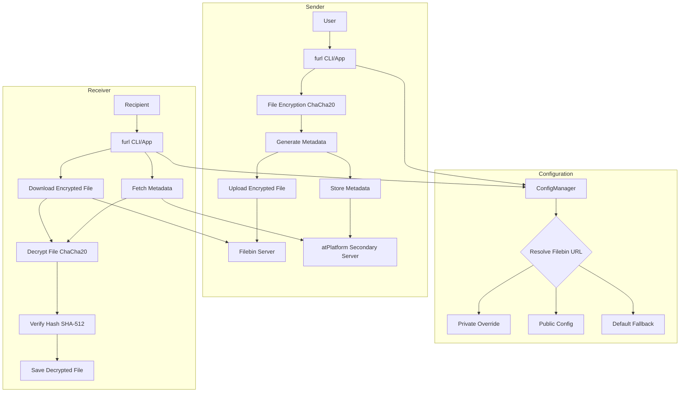
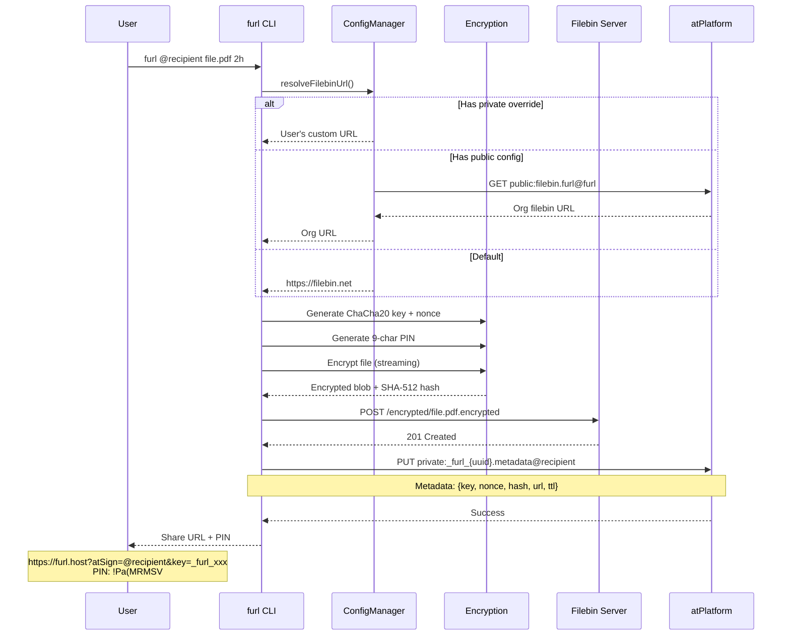
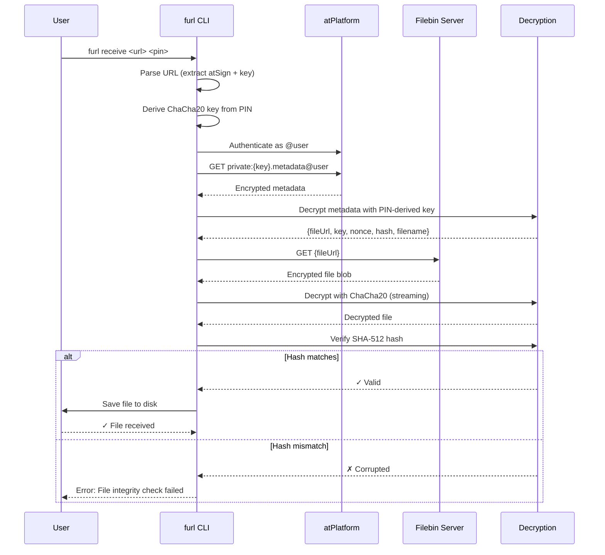
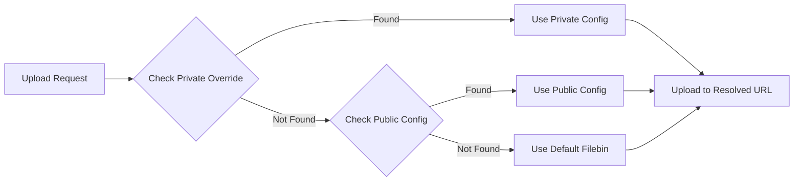
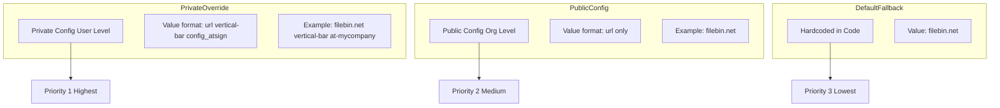
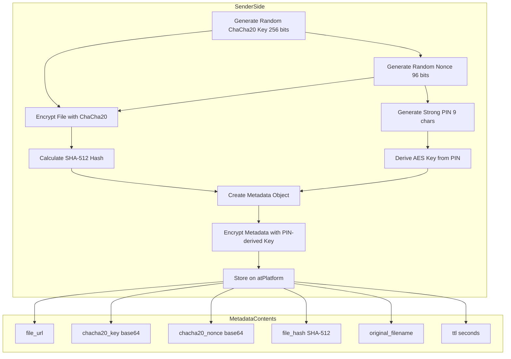

# Furl Architecture

## Overview

Furl is a secure file sharing system built on the atPlatform that combines end-to-end encryption with decentralized key management. Files are encrypted client-side, uploaded to a configurable filebin server, and the decryption metadata is stored securely on the atPlatform.

## Core Components

### 1. Encryption Layer
- **Algorithm**: ChaCha20 stream cipher with 256-bit keys
- **Key Generation**: Cryptographically secure random key generation
- **PIN Protection**: 9-character strong PIN with special characters
- **Integrity**: SHA-512 hash verification

### 2. Storage Layer
- **Filebin Server**: Stores encrypted file blobs (configurable)
- **atPlatform**: Stores decryption metadata in encrypted atKeys
- **Time-To-Live**: Automatic expiration from 30 seconds to 6 days

### 3. Configuration System
- **atKey-based**: Configuration stored in encrypted atKeys (not local files)
- **Three-tier resolution**: Private override → Public config → Default fallback
- **Real-time sync**: Changes propagate immediately across all devices

## System Architecture



## File Upload Flow



## File Download Flow



## Configuration Architecture

### Three-Tier Resolution



### Configuration Storage



**Note**: In the Private Config format, "vertical-bar" represents the `|` (pipe) character used as a delimiter.
The actual stored value is: `https://filebin.net|@mycompany` (URL, pipe, atSign).

## Encryption Details

### Key Derivation and Storage



### Security Properties

1. **End-to-End Encryption**: Files are encrypted on sender's device, only decrypted on recipient's device
2. **Zero-Knowledge**: Filebin server never sees plaintext or decryption keys
3. **Secure Key Exchange**: Decryption metadata stored in recipient's private atKey space
4. **PIN Protection**: Additional layer requires out-of-band PIN sharing
5. **Integrity Verification**: SHA-512 hash ensures file wasn't tampered with
6. **Time-Limited**: Automatic expiration prevents long-term exposure

## Cache Management

### Remote Fetch Strategy

To prevent stale cached values, all configuration reads and writes use `useRemoteAtServer = true`:

```dart
// GET operations - Always fetch from remote
final getRequestOptions = GetRequestOptions()..useRemoteAtServer = true;
final result = await atClient.get(atKey, getRequestOptions: getRequestOptions);

// PUT operations - Always write to remote
final putRequestOptions = PutRequestOptions()..useRemoteAtServer = true;
await atClient.put(atKey, value, putRequestOptions: putRequestOptions);

// Brief sync delay for secondary server propagation
await Future.delayed(Duration(milliseconds: 500));
```

This ensures:
- Users immediately see updated filebin configurations
- No cache staleness when admin publishes new URLs
- Consistent behavior across all devices

## CLI Commands

### Upload
```bash
furl @recipient file.pdf 2h [-v] [-q] [-s URL] [-m "message"]
```

### Receive
```bash
furl receive <url> <pin> [-v] [-q] [-o /path/to/output]
```

### Configure Personal Override
```bash
furl set-filebin @alice https://my-filebin.com [@orgname] [-v]
```

### Publish Org-Wide Config
```bash
furl publish-filebin @orgname https://org-filebin.com [-v]
```

## Data Flow Summary

### Upload
1. User provides file, recipient atSign, and TTL
2. Resolve filebin URL from configuration (3-tier)
3. Generate ChaCha20 encryption key and nonce
4. Generate strong PIN for additional security
5. Encrypt file using streaming ChaCha20
6. Calculate SHA-512 hash for integrity
7. Upload encrypted blob to filebin server
8. Encrypt and store metadata in recipient's atKey
9. Return URL and PIN to sender

### Download
1. User provides furl URL and PIN
2. Parse URL to extract recipient atSign and metadata key
3. Authenticate to atPlatform as recipient
4. Fetch encrypted metadata from atKey
5. Decrypt metadata using PIN-derived key
6. Download encrypted file from filebin server
7. Decrypt file using ChaCha20 key from metadata
8. Verify SHA-512 hash matches
9. Save decrypted file to disk

## Technology Stack

- **Language**: Dart (CLI & Flutter)
- **Encryption**: ChaCha20 (via `encrypt` package)
- **Hashing**: SHA-512 (via `crypto` package)
- **atPlatform**: Decentralized key-value storage
- **File Storage**: Configurable filebin server (HTTP/HTTPS)
- **UI**: Flutter (mobile/desktop apps)

## Security Considerations

### Threats Mitigated
- ✅ Man-in-the-middle attacks (E2E encryption)
- ✅ Server compromise (encrypted blobs only)
- ✅ Unauthorized access (PIN + atPlatform auth)
- ✅ Data tampering (SHA-512 verification)
- ✅ Long-term exposure (automatic expiration)

### Threat Model
- ❌ Sender/recipient device compromise (out of scope)
- ❌ PIN shared insecurely (user responsibility)
- ❌ Quantum computing attacks (ChaCha20 is quantum-resistant)

## Future Enhancements

- [ ] Multiple file support (ZIP compression)
- [ ] Compression before encryption
- [ ] Resumable uploads/downloads
- [ ] Web-based receiver (no CLI needed)
- [ ] File sharing groups
- [ ] Audit logs
- [ ] Custom TTL policies per org
- [ ] S3-compatible storage backend

## Development

### Project Structure
```
furl/
├── bin/
│   ├── furl.dart              # CLI entry point
│   └── furl_server.dart       # Server component
├── lib/
│   ├── config_manager.dart    # Configuration storage
│   ├── filebin_resolver.dart  # URL resolution
│   └── validation.dart        # Input validation
├── flutter_furl/
│   └── lib/
│       ├── core/
│       │   └── services/      # Business logic
│       └── features/
│           ├── send/          # Upload UI
│           ├── receive/       # Download UI
│           └── settings/      # Config UI
└── test/
    └── furl_test.dart         # Unit tests
```

### Building
```bash
# CLI
dart compile exe bin/furl.dart -o furl

# Flutter app
cd flutter_furl
flutter build apk        # Android
flutter build ios        # iOS
flutter build macos      # macOS
flutter build windows    # Windows
```

## Contributing

See [CONTRIBUTING.md](CONTRIBUTING.md) for development guidelines.

## License

See [LICENSE](LICENSE) file for details.
